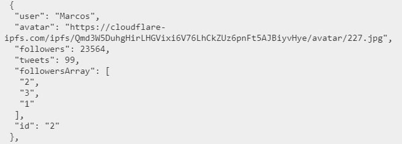
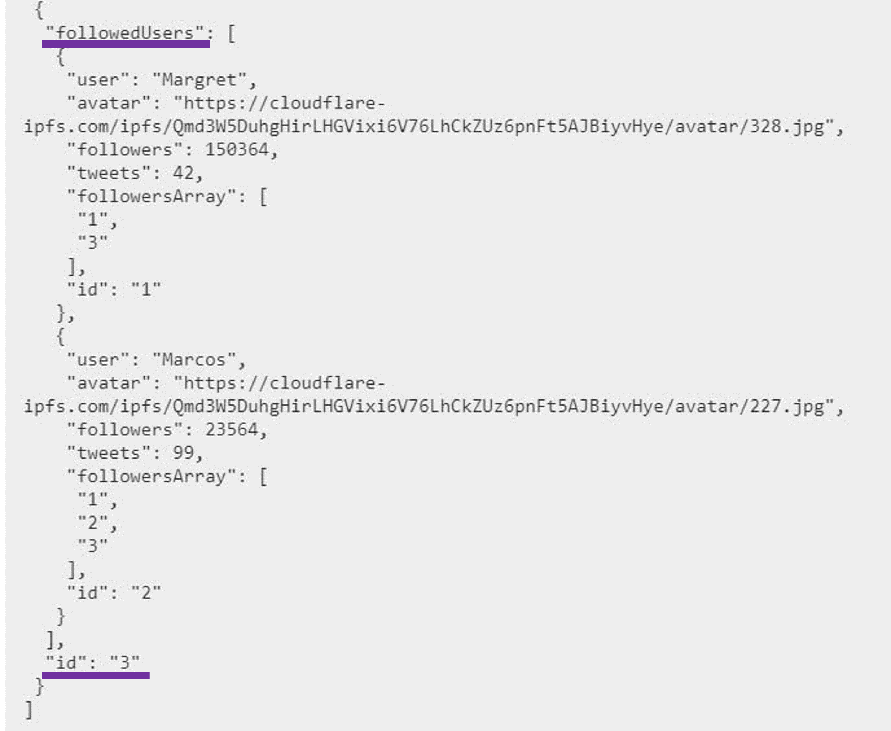

# Welcome to TWEETS!

Tweets is the app which provides followers logic for social media resources. 

## Description

App consists of 2 pages:

### Home 
includes action button, can be customized to parent source during implementation

### Tweets
includes cards of users and provides next functionality:

1. Adaptive card gallery
2. Each card user can be followed independantly from different gadgets and session
3. Amount of followers depends and changes accoarding to last api data
4. Cards can be filtered to 3 categories: show all, follow and followings (logic of getting follow onces doesn`t use best practices because of mockapi limits and should be replaced in real project)
5. Cards are shown dosed and can be loaded more by clicking corresponded button
6. Data saves after reloading page

## Database objects shemas

### user
includes information about users on cards

### session
includes information about sessions from different gadgets

## Materials and libraries

This project was 
- bootstrapped with [Create React App](https://github.com/facebook/create-react-app)
- styled with [@emotion](https://emotion.sh/docs/introduction) and [React Icons](https://react-icons.github.io/react-icons/)
- roted with [React Router](https://reactrouter.com/en/main)
- created using [Redux Toolkit](https://redux-toolkit.js.org/)
- provided with backend using [mockapi](https://mockapi.io/)

Here are:
[layout](https://www.figma.com/file/zun1oP6NmS2Lmgbcj6e1IG/Test?type=design&node-id=0-1&mode=design) and [technical task](https://drive.google.com/file/d/1XQnUiuhy6zndS8wN9ZonHZV6Iu0esiA1/view)

## Run the app in the development mode

In the project directory run:
### `npm start`
Open [http://localhost:3000](http://localhost:3000) to view it in your browser.
